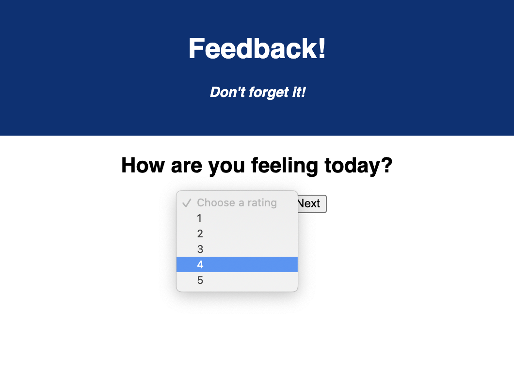

# Feedback App

Duration: 3 Days

## Description

This project is a feedback app which guides the user through a few questions. It then asks a user to review their input and submit it, at which point it gets added to a database.

## Prerequisites

- Node.js
- Postgres

## Installation

1. Create a database called "prime_feedback"
2. The queries in the "data.sql" show how to set up the tables for the database.
3. Open up your editor of choice and run npm install.
4. In one terminal, run npm run server.
5. Open another terminal and run npm run client.

## Usage

1. A user will begin on the home page and select "submit new feedback"
2. They will then select a rating for their feelings, support, and understanding for the day.
3. The user may then optinally leave some comments.
4. The user is asked to review their feedback for submission.
5. A thank-you page pops up and gives the user the opportunity to leave new feedback.

## Built With

- React
- Redux
- pool
- HashRouter

## Acknowledgement

Thanks to Prime Digital Academy and my instructor Dev who made this application possible.

## Support

If you have any questions, please e-mail me at natetreimer@gmail.com.